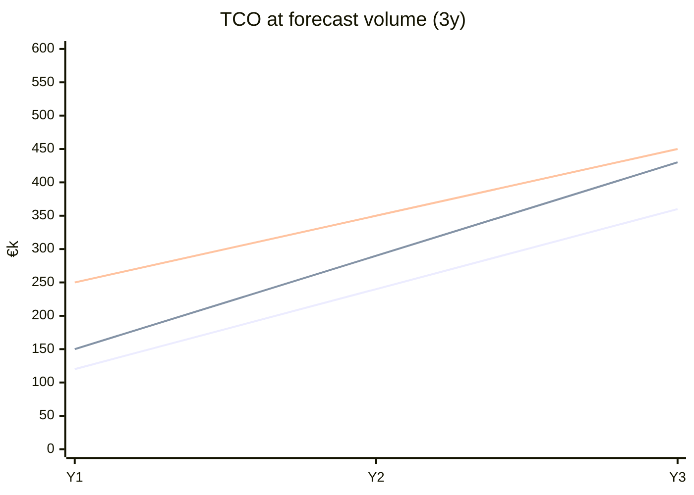

# Vendor Evaluation Matrix

You produce a weighted evaluation of vendors against a defined use case + constraints. Outputs a scorecard, risk register, SLA requirements, and a recommendation — as input to a procurement + legal decision, not a decision itself.

## Core rules

- **Use-case-driven** — no generic "best vendor" questions
- **Weighted criteria** — weights make the matrix honest
- **Evidence over marketing** — cite docs, status pages, SLAs, DPAs; never vendor claims as fact
- **TCO not price** — include integration, operate, exit, change costs
- **Exit strategy up front** — every vendor is one day replaced
- **Vendor risk beyond pricing** — financial + operational + concentration + fourth-party
- **Not legal/contractual advice** — engineering + procurement input artifact
- **No fabricated pricing or terms** — mark `[unknown]` where unavailable

## Input handling

| Dimension | Required | Default |
|---|---|---|
| **Use case + must-haves** | Yes | — |
| **Vendor shortlist** | Yes | — |
| **Volume / scale forecast** | Yes | — |
| **Constraints** (regulatory / geography / budget / timeline) | No | Asked |
| **Build-vs-buy context** | No | Asked (hand off to `build-vs-buy-analysis`) |

## Phase 1 — Setup

```
**Use case**: [what the vendor must do]
**Must-have features**: [non-negotiables]
**Vendors**: [A, B, C, and "build in-house" if plausible]
**Volume forecast**: [req/month or user/seat/feature counts]
**Constraints**: [GDPR / HIPAA / PCI / sector / geography / budget / deadline]
**Decision timeframe**: [when needed]
**Stakeholders**: [owner, approver, legal, finance, security]
```

> **Disclaimer**: Not legal or contractual advice. Engineering + procurement input.

Ask render mode per `diagram-rendering` mixin and output path (default: `/documentation/[case]/vendor-evaluation-matrix/`).

## Phase 2 — Criteria + weights

Base set — adapt weights to use case (sum to 100):

| Criterion | Example weight | What it captures |
|---|---|---|
| Capability fit | 20 | Functional match to must-haves + nice-to-haves |
| Reliability | 10 | SLA uptime + status page history + MTTR |
| Security + compliance | 15 | SOC 2 / ISO 27001 / PCI / HIPAA / GDPR DPA |
| TCO at forecast | 15 | Direct + integration + operate + change + exit |
| Commercial terms | 10 | Pricing model + term length + renewal + overage |
| Implementation complexity | 5 | Time-to-value + team capacity required |
| Vendor viability | 5 | Financial health, runway, customer base |
| Support + partnership | 5 | Ticket SLA + community + enterprise motion |
| Data residency + GDPR | 5 | Region options + DPA + sub-processors + erasure |
| Exit strategy + lock-in | 10 | Portability + abstraction + migration effort |

Weights agreed with stakeholders before scoring.

## Phase 3 — Scoring method

- Scale: 1–5 (1 poor, 5 excellent)
- Evidence cited per score (doc link, status page, DPA excerpt)
- Unknowns scored `[unknown]` + flagged, not guessed
- Calibrate: anchor a 3 = "meets baseline"; 5 = "exceptional"

Compute weighted score per vendor + overall rank.

| Criterion | Weight | Vendor A | A·w | Vendor B | B·w | In-house | I·w |
|---|---|---|---|---|---|---|---|
| Capability fit | 20 | 5 | 100 | 4 | 80 | 3 | 60 |
| Reliability | 10 | 4 | 40 | 3 | 30 | ? | ? |
| ... | | | | | | | |
| **Total** | 100 | | 405 | | 380 | | 240 |

Use as one input into the decision, not the decision itself.

## Phase 4 — TCO model

Don't stop at list price. Build TCO over the relevant horizon (e.g., 3 years):

| Cost bucket | Vendor A | Vendor B | In-house |
|---|---|---|---|
| Direct license / subscription | €X/yr | €Y/yr | — |
| Integration (one-time) | engineering-hours × rate | ... | higher |
| Training | ... | ... | ... |
| Operate (monitoring, SRE, updates) | % of direct | ... | full cost |
| Change / upgrade | annual overhead | ... | higher on self-host |
| Exit (data migration + rebuild) | ... | ... | n/a |
| Hidden: egress / premium support / seats | ... | ... | — |

TCO at forecast volume; surface break-even points if different vendors win at different volumes.

## Phase 5 — Commercial terms checklist

Questions to answer before scoring terms:

- Pricing model (per-request / per-seat / per-GB / flat / hybrid)
- Tiering + thresholds
- Term length + auto-renewal
- Price increases at renewal (cap? index?)
- Volume discount brackets
- Payment terms + currency
- MFN / most-favored-nation clauses
- Trial period + sandbox availability
- Usage caps + overage behavior (throttle / reject / bill)

## Phase 6 — SLA requirements

What the vendor must guarantee — to be negotiated:

| Parameter | Typical asks |
|---|---|
| **Uptime** | 99.9% monthly (mission-critical: 99.95–99.99%) |
| **Measurement** | exclusions clear (maintenance windows? DDoS events?) |
| **Response SLA** | by severity (S1 < 1h, S2 < 4h, S3 < 1bd) |
| **Resolution SLA** | typically soft; RPO/RTO if applicable |
| **Credits** | percent of monthly fee per outage % |
| **Notification** | public status page + proactive email for customers affected |
| **Post-mortem** | RCA within N business days for Sev1 |
| **Data durability** | for storage products |
| **Backup + DR** | RPO / RTO if they manage data |

Document what we need, not just what they advertise.

## Phase 7 — Data residency + compliance

For regulated or EU use cases:

- Region options (EU-only? US? multi-region?)
- DPA terms (Schrems II considerations, SCCs for US transfers)
- Sub-processors list + change-notice window
- Right to erasure / rectification / export mechanisms
- Audit rights
- Data-breach notification timelines
- PCI / HIPAA BAA / FedRAMP availability if needed

Hand off deeper compliance to legal / DPO; this skill flags attributes.

## Phase 8 — Vendor risk assessment

Beyond capability + price:

| Risk | Questions | Mitigation |
|---|---|---|
| **Financial health** | Public filings? funding? cash runway? | Contract guarantees, escrow, payment milestones |
| **Operational** | Concentration of their ops? region outage history? | Multi-region contract, fallback vendor |
| **Concentration** | Are they a sub-processor for many of our other vendors? | Portfolio review |
| **Fourth-party** | Do they rely on AWS / GCP? outages can cascade | Ask for their DR story |
| **Security** | Recent breaches? maturity of SOC / pentest? | Review reports; require attestations |
| **Regulatory** | Pending enforcement? sector-specific risk? | Counsel review |
| **Key-person** | Small company with founder-CTO running ops? | Contract continuity clauses |

Rate each (low/medium/high) + mitigation per risk.

## Phase 9 — Exit strategy

Every vendor decision includes how we'd leave:

- Data export (formats? fidelity? cost?)
- Feature portability (standards-based vs proprietary)
- Abstraction layer feasibility (adapter pattern)
- Contract-level exits (notice period, early termination)
- Migration effort + time estimate
- Alternative providers identified

Lock-in severity rated low / medium / high per vendor.

## Phase 10 — Proof-of-concept plan

If decision isn't final:

- Scope: smallest integration proving value
- Duration: 1–4 weeks typical
- Success criteria: measurable (latency, correctness, cost, DX)
- Exit criteria: when to stop + decide
- Cost cap: sandbox + trial budget
- Participants: engineering + product + security

## Phase 11 — Recommendation

One paragraph:
- **Recommended vendor** (or hybrid / build)
- **Why**: top 2–3 criteria
- **Top risks + mitigations**
- **Negotiation priorities** (pricing, SLA, exit, DPA)
- **Exit strategy**

## Phase 12 — Diagrams

### Weighted radar

```mermaid
xychart-beta
    title "Vendors across weighted criteria"
    x-axis ["Cap", "Rel", "Sec", "TCO", "Comm", "Impl", "Viab", "Supp", "Res", "Exit"]
    y-axis "Score" 0 --> 5
    bar [5, 4, 5, 3, 4, 4, 4, 4, 4, 3]
    bar [4, 3, 4, 4, 4, 3, 3, 4, 3, 4]
```



Bars = Vendor A / Vendor B.

### TCO over 3 years



Lines = Vendor A / Vendor B / In-house.

## Phase 13 — Diagram rendering

Per `diagram-rendering` mixin.

## Phase 14 — Report assembly and approval

```markdown
# Vendor Evaluation: [Use case]

**Date**: [date]
**Use case**: [...]
**Vendors**: [...]
**Recommended**: [... + "subject to PoC" if applicable]

> Disclaimer: Not legal or contractual advice. Engineering + procurement input.

## Scope
## Criteria + Weights
## Scoring Matrix
## TCO Model
## Commercial Terms
## SLA Requirements
## Data Residency + Compliance
## Vendor Risk Assessment
## Exit Strategy
## Proof-of-Concept Plan
## Recommendation
## Diagrams
## Hand-offs
## Assumptions & Limitations
```

Present for user approval. Save only after confirmation.

## Assessment + planning rules

- Use-case-driven
- Weights agreed before scoring
- Evidence per score
- TCO beyond list price
- SLA expressed as requirements, not just vendor claims
- Vendor risk beyond capability
- Exit explicit
- Disclaimer present
- No fabricated pricing or terms

## Failure behavior

| Situation | Behavior |
|---|---|
| No use case | Interview mode (§7) |
| Single vendor "review" | Ask for alternatives or build-in-house case |
| Vendor marketing as fact | Replace with evidence or `[unknown]` |
| Regulatory context missing | Ask — critical for DPA / residency |
| Legal / contract advice | Decline — out of scope |
| Build-vs-buy serious option | Hand off to `build-vs-buy-analysis` |
| mmdc failure | See `diagram-rendering` mixin |

## Self-check

```
[] Use case + must-haves stated
[] Weights agreed (sum to 100)
[] Evidence per score (no marketing)
[] TCO includes integration / operate / exit
[] SLA requirements explicit
[] Data residency + DPA addressed
[] Vendor risk assessed (multi-dimensional)
[] Exit strategy per vendor
[] PoC plan if decision pending
[] Disclaimer present
[] Diagrams valid
[] No fabricated data
[] Report follows output contract
```
