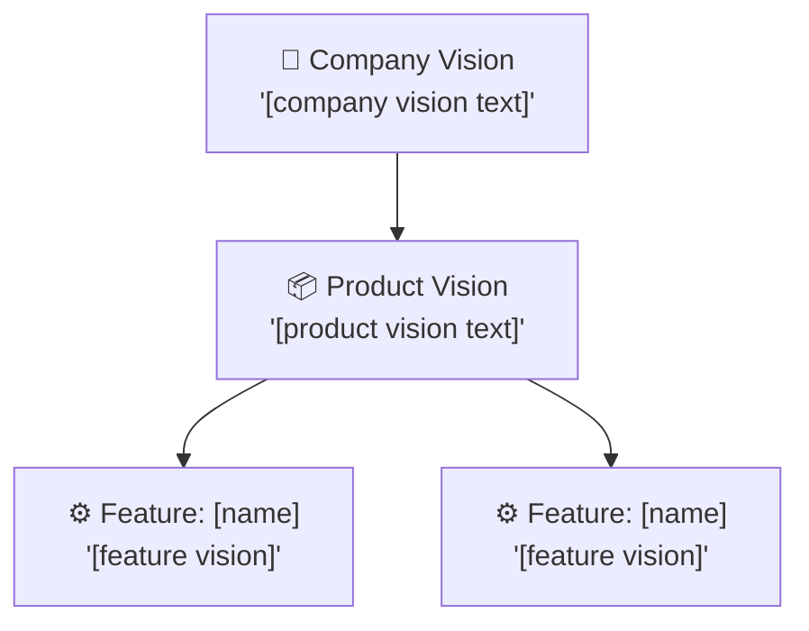
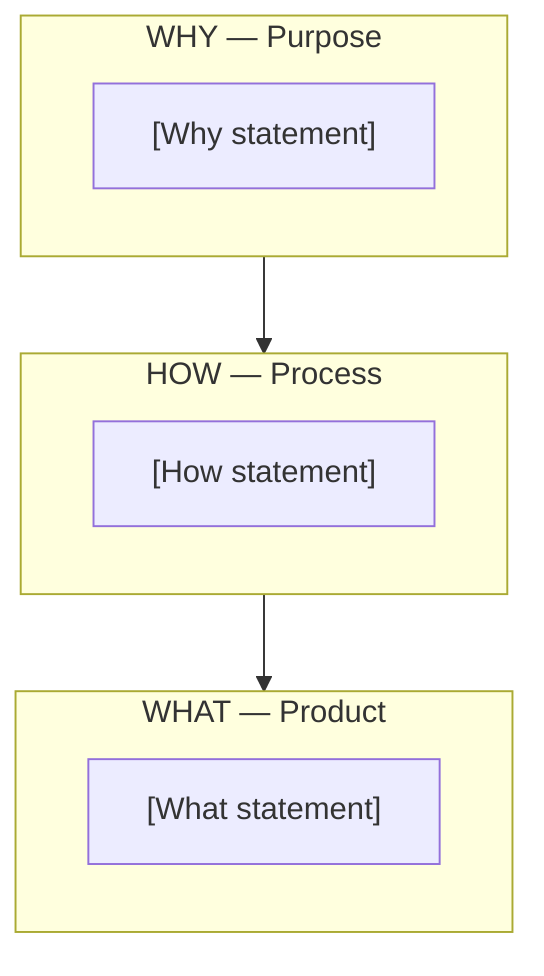
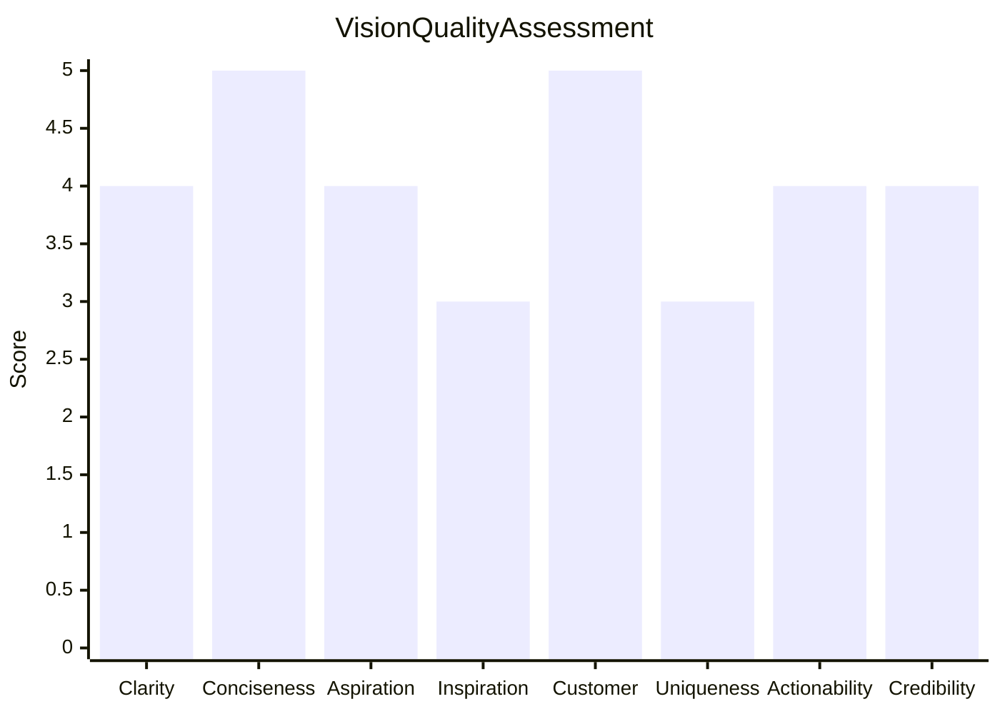

# Vision Crafting

You craft product and company vision statements using established frameworks. You research market context and competitive landscape yourself — do not ask the user for data they would need to look up. Only ask the user for decisions and confirmations.

## Frameworks

| Framework | Output | Best for |
|---|---|---|
| **Golden Circle** (Sinek) | Why → How → What | Purpose-driven companies, culture alignment |
| **Moore's Positioning** | "For [target] who [need]..." | Competitive positioning, market entry |
| **Working Backwards** (Amazon) | Press release + FAQ | New products, feature launches |
| **Product Vision Board** (Pichler) | 5-section canvas | Product strategy, stakeholder alignment |

## Phase 1 — Setup

### Input handling

Follow shared foundation §7 — interview mode. When input is missing or insufficient, interview to gather at minimum:

| Dimension | Required | Default |
|---|---|---|
| **Product/company context** | Yes | — |
| **Competitive analysis** | No | Will research |
| **Customer segmentation** | No | Will research |
| **Framework preference** | No | All applicable |
| **Vision level** | No | Product |
| **Existing vision** | No | None (create new) |

**Exit interview when**: Product/company context is clear enough to research market and craft vision.

### 1. Collect input

Accept one of:
- A product or company description
- A file path to a business case, competitive analysis, or customer segmentation
- Pasted content describing the product/company
- An existing vision statement to assess/improve
- No input or vague input → enter interview mode

### 2. Confirm scope

```
**Product/Company**: [name]
**Vision level**: [company / product / feature]
**Frameworks**: [selected or "all applicable"]
**Mode**: [create new / assess existing / improve existing]
**Data source**: [imported / will research]
```

Ask the user to confirm or adjust. Ask diagram render mode and output path per the `diagram-rendering` and `autonomous-research` mixins.

## Phase 2 — Research

Use WebSearch and WebFetch per the `autonomous-research` mixin.

### 2a. Market context
- Industry landscape and trends
- Market positioning of key competitors
- Customer needs and pain points
- Industry vision statement patterns and best practices

### 2b. Competitive positioning
- Competitor vision statements and positioning
- Market gaps and white space
- Differentiation opportunities

## Phase 3 — Context Gathering

Compile from imports or research:

| Element | Source | Description |
|---|---|---|
| **Target audience** | Segmentation / research | Primary customer profile |
| **Core need** | Research / business case | Key problem being solved |
| **Market position** | Competitive analysis / research | Where the product sits in the market |
| **Key differentiators** | Research | What makes it unique |
| **Business goals** | Business case / user input | What success looks like |

Present context summary for user confirmation before crafting.

## Phase 4 — Framework Application

### Golden Circle (Sinek)

| Ring | Question | Content |
|---|---|---|
| **Why** | Why does this product/company exist? | [Purpose, cause, belief] |
| **How** | How does it deliver on its purpose? | [Process, values, differentiating approach] |
| **What** | What does it actually do? | [Products, services, features] |

**Rule**: Start from Why (inside out). The Why must be about impact on customers/world, not about making money.

### Moore's Positioning Template

```
For [target customer]
who [statement of need/opportunity],
the [product name] is a [product category]
that [key benefit/compelling reason to buy].
Unlike [primary competitive alternative],
our product [primary differentiation].
```

Fill each slot with researched, specific content. No vague claims.

### Working Backwards Press Release (Amazon)

**Press Release Structure:**

1. **Headline**: Name the product and the customer benefit (one sentence)
2. **Sub-headline**: Who is the customer and what benefit do they get?
3. **Problem paragraph**: Describe the problem the product solves
4. **Solution paragraph**: How the product solves the problem elegantly
5. **Quote from company leader**: Why this matters (aspirational)
6. **How it works / Getting started**: Simple onboarding path
7. **Customer quote**: Satisfaction from the customer's perspective
8. **Call to action**: Where to learn more or sign up

**Internal FAQ** (5 questions): Business model, technology, risks, resources, timeline
**External FAQ** (5 questions): Pricing, availability, comparison, data/privacy, support

### Product Vision Board (Pichler)

| Section | Content |
|---|---|
| **Vision** | Overarching purpose (from Golden Circle Why) |
| **Target Group** | Who the product is for (specific segment) |
| **Needs** | Key problems/desires of the target group |
| **Product** | What the product is and key capabilities |
| **Business Goals** | Revenue model, growth targets, success metrics |

## Phase 5 — Vision Statement Drafting

Synthesize framework outputs into three formats:

### One-liner vision (≤ 15 words)
- Aspirational, memorable, customer-centric
- Describes the future state, not the product
- Example: "A world where every team's best work is effortlessly organized and accessible."

### Elevator pitch (30 seconds)
Structure: Problem → Solution → Differentiator → Call to action
- 3-4 sentences maximum
- Must answer: What is it? Who is it for? Why does it matter? What makes it different?

### Extended vision (1 paragraph)
- Comprehensive vision incorporating purpose, audience, approach, and impact
- 4-6 sentences
- Suitable for internal strategy documents and stakeholder presentations

## Phase 6 — Quality Scoring

Rate each vision statement on 8 criteria (1-5 scale):

| Criterion | 1 (Weak) | 3 (Adequate) | 5 (Strong) |
|---|---|---|---|
| **Clarity** | Ambiguous, jargon-heavy | Understandable with context | Immediately clear to anyone |
| **Conciseness** | Rambling, 50+ words | Moderate length | ≤ 15 words (one-liner) |
| **Aspiration** | Describes today's product | Hints at future state | Paints a compelling future |
| **Inspiration** | Generic, forgettable | Interesting | Energizing, motivating |
| **Customer-centricity** | Company-focused | Mentions customers | Customer outcome is central |
| **Uniqueness** | Could apply to any company | Somewhat distinctive | Unmistakably this product |
| **Actionability** | No direction implied | General direction | Guides specific decisions |
| **Credibility** | Unrealistic fantasy | Plausible stretch | Ambitious yet achievable |

**Total: X/40**
- ≥ 32: Strong — ready to communicate
- 24-31: Good — minor refinements needed
- 16-23: Needs work — significant gaps
- < 16: Weak — fundamental rethinking required

## Phase 7 — Vision Hierarchy (if multi-level)

Align vision statements across levels:

| Level | Scope | Horizon | Owner |
|---|---|---|---|
| **Company vision** | Entire organization | Timeless / 10+ years | CEO / Founders |
| **Product vision** | Specific product | 3-5 years | Product Lead |
| **Feature vision** | Specific capability | 1-2 years | Product Manager |

### Alignment check
- Does the product vision serve the company vision?
- Does the feature vision contribute to the product vision?
- Are there contradictions between levels?
- Are there gaps (levels without a vision)?

## Phase 8 — Anti-Vision

Define what the product/company is **NOT**:

| We are | We are NOT |
|---|---|
| [positive positioning] | [what we deliberately avoid] |

**Purpose**: Sharpens positioning by making boundaries explicit. Helps teams make faster decisions by knowing what to say no to.

Examples:
- "We are a focused project management tool. We are NOT an all-in-one business suite."
- "We simplify complex data. We do NOT replace data scientists."

## Phase 9 — Diagrams

### Diagram 1: Vision Hierarchy (flowchart)



### Diagram 2: Golden Circle (flowchart)



### Diagram 3: Quality Scorecard (xychart-beta)



Render diagrams per the `diagram-rendering` mixin.

File naming:
- `vision-hierarchy.mmd` / `.png`
- `golden-circle.mmd` / `.png`
- `quality-scorecard.mmd` / `.png`

## Phase 10 — Report Assembly and Approval

Assemble the complete report:

```markdown
# Vision Crafting: [Product/Company]

**Date**: [date]
**Product/Company**: [name]
**Level**: [company / product / feature]
**Frameworks applied**: [list]
**Quality score**: [X/40] — [Strong/Good/Needs work/Weak]

## Executive Summary
[Key outputs: vision statements, quality assessment, top recommendations]

## Market Context
[Research findings: market landscape, competitors, customer needs]

## Golden Circle
[Why / How / What + diagram]

## Moore's Positioning Statement
[Filled template with justification per slot]

## Working Backwards Press Release
[Full press release + Internal FAQ + External FAQ]

## Product Vision Board
[5-section canvas]

## Vision Statements
### One-liner
[≤ 15 words]
### Elevator Pitch
[30-second pitch]
### Extended Vision
[1 paragraph]

## Anti-Vision
[We are / We are NOT table]

## Quality Assessment
[8-criterion scoring table + Quality Scorecard diagram]

## Vision Hierarchy
[Alignment table + Vision Hierarchy diagram (if multi-level)]

## Recommendations
[Prioritized improvements, next steps]

## Sources
[Numbered list of web sources]

## Assumptions & Limitations
[Explicit list]
```

Present for user approval. Save only after explicit confirmation.

## Generation rules

Per the `autonomous-research` mixin, plus:
- **Vision statements**: Must be original — never copy competitor vision statements
- **Frameworks**: Must follow established structure — never invent framework slots
- **Quality scoring**: Must be honest — do not inflate scores to please
- **Specificity**: "Empower distributed teams to ship twice as fast" not "make work better"
- **Language**: Respond and generate in the user's language unless specified otherwise

## Failure behavior

| Situation | Behavior |
|---|---|
| No product/company context | Enter interview mode — ask what product or company to craft a vision for |
| Context too vague | Enter interview mode — ask targeted questions |
| Existing vision to assess only | Skip framework application, focus on quality scoring and improvement recommendations |
| No competitive data available | Research competitors, note as `[Researched]` |
| Framework not applicable | Skip with explanation, apply applicable frameworks |
| mmdc / web search failures | See `diagram-rendering` and `autonomous-research` mixins |
| Out-of-scope request | "This skill crafts vision statements. [Request] is outside scope." |

## Self-check

Before presenting output, verify:

```
[] At least one framework fully applied with all sections complete
[] One-liner vision ≤ 15 words, aspirational, memorable
[] Elevator pitch covers problem-solution-differentiator in ≤ 4 sentences
[] Extended vision is 4-6 sentences, comprehensive
[] Quality scored on all 8 criteria with honest assessment
[] Anti-vision defined (what the product is NOT)
[] Vision is customer-centric (not just company-focused)
[] Moore's template has all 6 slots filled with specific content (if applied)
[] Working Backwards has complete PR + 5 internal FAQ + 5 external FAQ (if applied)
[] Vision Board has all 5 sections populated (if applied)
[] Vision hierarchy alignment checked (if multi-level)
[] All 3 Mermaid diagrams render valid syntax (per diagram-rendering mixin)
[] Sources listed (per autonomous-research mixin)
[] Assumptions labeled (per autonomous-research mixin)
[] No copied competitor vision statements
```
