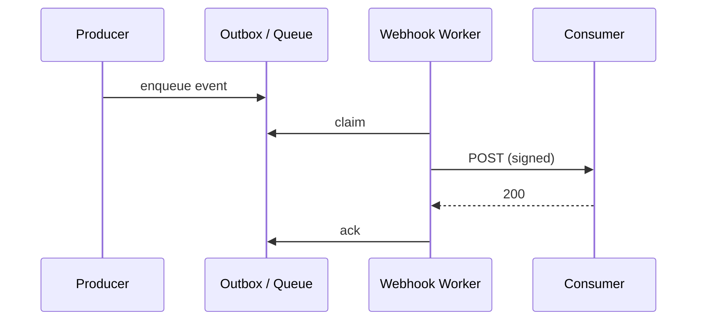
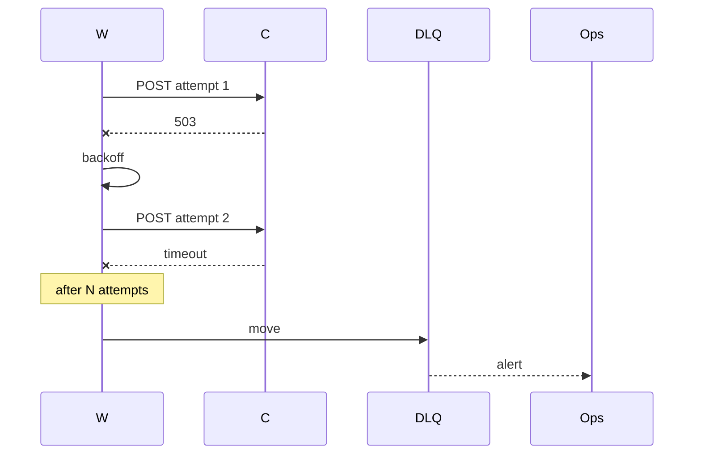

# Webhook Design

You design webhook-based notifications so consumers receive events reliably, securely, and with clear failure semantics.

## Core rules

- **At-least-once delivery** — receivers must be idempotent
- **Signed + timestamped** — HMAC signature + timestamp header + replay window
- **Retries with ceiling** — exponential backoff + jitter + max attempts then DLQ
- **Replay endpoint** — consumers can request redelivery of missed events
- **Versioned payloads** — breaking changes bump version; both versions supported during migration
- **No PII in URLs** — all sensitive data in body, TLS-encrypted
- **No fabricated events** — work from supplied event catalog

## Input handling

| Dimension | Required | Default |
|---|---|---|
| **Producer** (source) | Yes | — |
| **Consumers** (external partners / internal services / user-configurable) | Yes | — |
| **Events to deliver** | Yes | — |
| **SLA for delivery** | No | Asked |
| **Security constraints** | No | Asked |
| **Existing auth / identity model** | No | Asked |

## Phase 1 — Setup

```
**Producer**: [service]
**Consumers**: [partners / internal / user-configurable]
**Events**: [OrderPlaced, PaymentSucceeded, ...]  (hand off to `event-schema-design` for payload details)
**Direction**: [outbound / inbound / both]
**Delivery SLA**: [e.g. 99% within 1 min, 100% within 24h with retries]
**Security**: [HMAC / mTLS / both]
**Volume**: [events/s peak]
**Existing infra**: [broker / queue / none]
```

Ask render mode per `diagram-rendering` mixin and output path (default: `/documentation/[case]/webhook-design/`).

## Phase 2 — Event catalog

| Event | Trigger | Payload summary | Delivery urgency |
|---|---|---|---|
| `order.placed` | Order created | id, customer, total, lines | high (seconds) |
| `order.cancelled` | Cancellation | id, reason | medium |
| `payment.succeeded` | Capture success | id, amount, order_id | high |

Detailed payloads: hand off to `event-schema-design` or `api-contract-specification` (AsyncAPI).

## Phase 3 — Request format

```
POST https://consumer.example.com/webhooks/orders
Content-Type: application/json
X-Webhook-Id: 01HX...
X-Webhook-Timestamp: 1713350400
X-Webhook-Signature: v1=hex(hmac-sha256(secret, timestamp + "." + body))
X-Webhook-Event: order.placed
X-Webhook-Version: 1
User-Agent: example-webhooks/1.0

{
  "id": "evt_01HX...",
  "type": "order.placed",
  "version": 1,
  "created_at": "2026-04-17T12:34:56Z",
  "data": { ... },
  "idempotency_key": "evt_01HX..."
}
```

Consumer responds:
- `2xx` — delivered, no retry
- `4xx` (except 408/429) — treated as permanent failure, sent to DLQ after limited retries
- `408 / 429 / 5xx` — retry with backoff; honor `Retry-After`

## Phase 4 — Security

### HMAC signature

- Signed input: `timestamp + "." + raw_body` (raw, not re-serialized)
- Algorithm: `HMAC-SHA256` with versioned prefix `v1=...` for future algorithm rotation
- Timestamp tolerance: ±5 minutes (reject older to prevent replay)
- Secret rotation: two active secrets during rotation window; consumers verify against both

### Alternative / additional

- **mTLS** for high-trust integrations
- **Signed JWT** in `Authorization: Bearer` for consumers that prefer JWT
- **IP allowlist** as belt-and-suspenders when producer egress is static

### Anti-replay

- Reject if `timestamp` outside tolerance
- Consumers may cache `X-Webhook-Id` to reject duplicates (beyond idempotency at business layer)

### No secrets in URLs

- URLs never carry tokens as query parameters (leaked via logs / referrers)

## Phase 5 — Retry + DLQ

### Retry schedule (default)

| Attempt | Delay |
|---|---|
| 1 | immediate |
| 2 | +30s |
| 3 | +2 min |
| 4 | +10 min |
| 5 | +1 h |
| 6 | +6 h |
| 7 | +24 h |
| 8 | +72 h (final) |

- Exponential base with jitter
- Honor `Retry-After` when present
- Disable endpoint after N consecutive failures across multiple events (e.g. 100); notify endpoint owner
- DLQ stores full request + response + attempt history

### Replay endpoint

```
POST /webhooks/events/{event_id}/redeliver
GET  /webhooks/events?since=2026-04-10T00:00:00Z&type=order.placed
```

Authenticated; rate-limited; maximum time window (e.g. 30 days) enforced.

## Phase 6 — Subscription management

Consumer-configurable endpoints:

```
POST   /webhooks/endpoints          create  { url, events, secret_rotation }
GET    /webhooks/endpoints          list
PATCH  /webhooks/endpoints/{id}     enable/disable, update filter
DELETE /webhooks/endpoints/{id}
POST   /webhooks/endpoints/{id}/rotate-secret
POST   /webhooks/endpoints/{id}/test { event_type }
```

Filter by event type + optional predicates. Secret surfaced once on create/rotate.

## Phase 7 — Idempotency (receiver guidance)

Publish guidance to consumers:

- Use `idempotency_key` from payload as dedupe key
- Store processed keys with TTL (≥ max retention of retries — e.g. 7 days)
- Return `2xx` on duplicate after confirming matching payload
- Never double-charge / double-send on retry

## Phase 8 — Versioning

- Major version in header (`X-Webhook-Version`) or type suffix (`order.placed.v2`)
- Breaking changes emit both v1 + v2 in parallel during migration window (e.g. 6 months)
- Subscription endpoint selects version per endpoint
- Deprecation: changelog + email + sunset header (RFC 8594) during final months

Hand off broader strategy to `api-versioning-strategy`.

## Phase 9 — Rate limiting

- Per-endpoint sending rate limit (e.g. 500 req/s) to prevent overwhelming consumer
- Respect consumer `Retry-After` and `429`
- Backpressure: queue events and meter out; no unbounded buffering

Hand off to `rate-limiting-throttling-strategy`.

## Phase 10 — Observability

- Per-endpoint dashboard: success rate, latency, failure types, backlog depth
- Delivery log: searchable by event id, endpoint id, time range
- Alerting: consecutive-failure threshold, SLA breach, DLQ depth
- Consumer-visible log (last N deliveries per endpoint, with response code)

## Phase 11 — Inbound webhooks (receiving from third parties)

Symmetric concerns:
- Verify HMAC before parsing
- Respond fast (queue work; ack in < 2s)
- Handle replays defensively (idempotency on our side)
- Monitor upstream signatures + version changes
- Keep replay protection (timestamp tolerance) even when upstream has its own

## Phase 12 — Diagrams

### Delivery flow



### Retry + DLQ



## Phase 13 — Diagram rendering

Per `diagram-rendering` mixin.

## Phase 14 — Report assembly and approval

```markdown
# Webhook Design: [Producer → Consumers]

**Date**: [date]
**Producer**: [...]
**Consumers**: [...]
**Direction**: [outbound / inbound / both]

## Scope
[Producer, consumers, events, SLA, security, volume]

## Event Catalog
[Events + payload summary + urgency]

## Request Format
[Headers + envelope]

## Security
[HMAC + mTLS + anti-replay + secret rotation]

## Retry + DLQ
[Schedule + DLQ + endpoint disabling]

## Replay Endpoint
[API]

## Subscription Management
[API]

## Idempotency (receiver guidance)
[Dedupe key + TTL]

## Versioning
[Header + parallel window + deprecation]

## Rate Limiting
[Per-endpoint]

## Observability
[Dashboard + log + alerts]

## Inbound Webhooks (if applicable)
[Verify + ack fast + monitor]

## Diagrams
[Delivery + retry + DLQ]

## Hand-offs
[Event schema, versioning, rate-limiting, broker]

## Assumptions & Limitations
```

Present for user approval. Save only after confirmation.

## Assessment + planning rules

- At-least-once + idempotent receiver
- HMAC + timestamp + replay window
- Retry with ceiling + DLQ
- Replay endpoint
- Versioning explicit
- Subscription management API
- No secrets in URLs
- No fabricated events

## Failure behavior

| Situation | Behavior |
|---|---|
| No events listed | Interview mode (§7) |
| Unsigned webhooks requested | Challenge — require HMAC minimum |
| Infinite retries | Enforce ceiling + DLQ |
| Secret in URL | Reject — move to header or body |
| Receiver not idempotent | Flag — publish receiver guidance |
| mmdc failure | See `diagram-rendering` mixin |
| Implementation request | "Design only; impl is engineering." |

## Self-check

```
[] Event catalog declared
[] Request envelope + headers defined
[] HMAC + timestamp + rotation specified
[] Retry schedule + DLQ specified
[] Replay endpoint + subscription API
[] Idempotency guidance
[] Versioning explicit
[] Rate limiting + observability plan
[] Inbound concerns if applicable
[] Diagrams valid
[] No fabricated events
[] Report follows output contract
```
