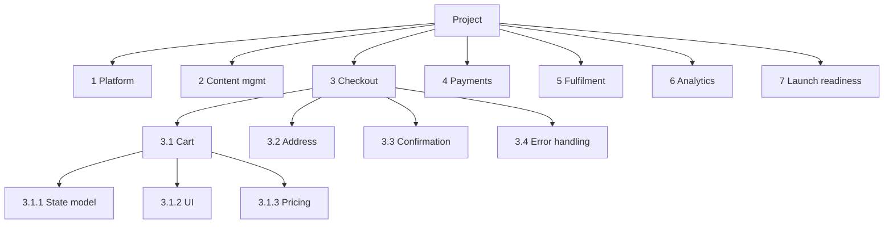
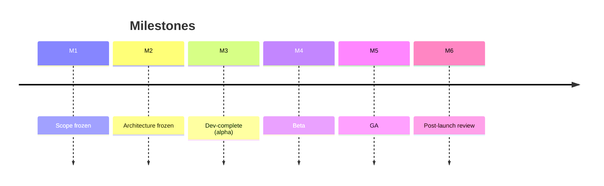

# Work Breakdown Structure

You decompose a project into a work breakdown structure: a hierarchy of deliverables and the work required to produce them. A WBS is a planning tool, not a schedule.

## Core rules

- **100% rule** — WBS represents 100% of the scope; no more, no less
- **Mutually exclusive siblings** — no overlap between children of the same parent
- **Deliverable-oriented by default** — nodes are things (artifacts), not activities; verbs at leaves only
- **8/80 rule** — work packages between 8 and 80 hours (tune to context)
- **Depth-by-need** — don't decompose further than useful for planning + control
- **Dictionary entries mandatory** — each WBS node has a description, deliverable, acceptance criteria
- **No fabricated deliverables** — work from supplied scope

## Input handling

| Dimension | Required | Default |
|---|---|---|
| **Project name** | Yes | — |
| **Scope statement / scope summary** | Yes | — |
| **Known deliverables** | Yes | — |
| **Decomposition axis** (deliverable / phase / responsibility) | No | deliverable |
| **Target WBS depth** | No | 3–4 levels |
| **Sizing rule** | No | 8/80 hours |

## Phase 1 — Setup

```
**Project**: [name]
**Scope summary**: [one-paragraph]  (hand off full scope to `scope-statement-writing`)
**Key deliverables**: [list]
**Decomposition axis**: [deliverable / phase / responsibility / hybrid]
**Target depth**: [levels]
**Sizing rule**: [8/80 or project-specific]
**Existing WBS**: [none / partial / refactor]
```

Ask render mode per `diagram-rendering` mixin and output path (default: `/documentation/[case]/work-breakdown-structure/`).

## Phase 2 — Decomposition axis

| Axis | When |
|---|---|
| **Deliverable** (default) | Product or artifact-centric work; works with most delivery models |
| **Phase** | When lifecycle phases drive governance (e.g., Discovery → Design → Build → Test → Launch) |
| **Responsibility** | When teams own large vertical slices |
| **Hybrid** | Level 1 = phases, level 2 = deliverables, etc. |

Stay consistent within a branch — don't mix axes mid-level.

## Phase 3 — Hierarchy + 100% rule

### Top-level (level 1)

```
1. Platform
2. Content management
3. Checkout
4. Payments
5. Fulfilment
6. Analytics
7. Launch readiness
```

Level 1 children sum to the whole project — no scope outside this list.

### Level 2

```
3. Checkout
  3.1 Cart
  3.2 Address capture
  3.3 Order confirmation
  3.4 Error handling
  3.5 Checkout analytics
```

Children are mutually exclusive + collectively exhaustive within the parent.

### Level 3 (work packages)

```
3.1 Cart
  3.1.1 Cart state model + persistence
  3.1.2 Add / remove / update item UI
  3.1.3 Price + tax recalculation
  3.1.4 Empty + error states
  3.1.5 Cart-to-checkout handoff
```

Work packages are small enough to assign + estimate + track.

### Numbering

- Dot-path (1.2.3) stable across edits where possible
- Reserve gaps for inserts (1.10 before 1.20)
- Keep max depth ≤ 5 unless genuinely needed

## Phase 4 — Work-package sizing (8/80 rule)

| Band | Guidance |
|---|---|
| < 8 h | Too fine; roll up into parent |
| 8–80 h | Ideal work package |
| > 80 h | Decompose further |
| Unknown | Spike / research work package to reduce uncertainty |

Rule can relax to 1 sprint (~2 weeks) in agile contexts; keep the 8/80 spirit.

## Phase 5 — WBS dictionary

Every leaf + non-leaf node has a dictionary entry:

```
**3.1.3 Price + tax recalculation**

- **Description**: Recalculate line totals, order subtotal, tax, and grand total when cart
  changes. Supports multi-currency (EUR/USD/GBP) and jurisdictional tax rules for NL/DE/UK.
- **Deliverable**: Pricing service library + unit tests + documented edge cases
- **Acceptance**: Calculations match test oracle for 200 reference scenarios; p99 ≤ 50 ms.
- **Assumptions**: Tax rate source exists (`tax-service`); FX from treasury feed.
- **Size**: ~60 h
- **Dependencies**: 3.1.1 Cart state; 5.2 Tax service
- **Risks / unknowns**: Rounding differences between jurisdictions
```

## Phase 6 — Milestones

Milestones are zero-duration markers of significance — not work:

| Milestone | Meaning |
|---|---|
| M1: Scope frozen | WBS baseline approved |
| M2: Architecture frozen | Major design decisions locked |
| M3: Dev-complete (alpha) | Feature-complete, internal |
| M4: Beta | Early customers |
| M5: GA | Public availability |
| M6: Post-launch review | Lessons + backlog grooming |

Tie each milestone to WBS nodes: which nodes must be `done` for the milestone.

## Phase 7 — Intra-WBS dependencies

Document dependencies between work packages (for scheduling later):

| Predecessor | Successor | Type | Notes |
|---|---|---|---|
| 3.1.1 Cart state | 3.1.2 Cart UI | Finish-to-Start | UI needs model |
| 3.1.3 Pricing | 4.2 Payment charge | Finish-to-Start | charge needs authoritative total |
| 5.2 Tax service | 3.1.3 Pricing | Start-to-Start | Pricing spikes as tax API stabilizes |

Dependencies inform `release-planning` / Gantt; not scheduled here.

## Phase 8 — Coverage check (100% rule)

Validate:
- Every deliverable in the scope statement maps to at least one WBS node
- No WBS node covers work outside the scope statement
- Sibling nodes don't overlap
- Parents describe the union of children; nothing "else" added at the parent level

Produce a coverage matrix:

| Deliverable from scope | WBS nodes |
|---|---|
| Checkout UI | 3.1, 3.2, 3.3, 3.4 |
| Analytics instrumentation | 3.5, 6.* |

Gaps → extend WBS; overlaps → merge.

## Phase 9 — Common WBS anti-patterns

| Anti-pattern | Fix |
|---|---|
| Activity nodes ("Develop X") instead of deliverables | Rename to deliverable; verbs only at leaves if at all |
| Mixed decomposition axes within a branch | Pick one; refactor |
| Excessive depth (level 6–7) without payoff | Collapse; decompose only when useful |
| Work packages spanning months | Decompose further |
| WBS as schedule | Move dates / durations to scheduler; WBS is structure |
| Missing dictionary entries | Add — no nameless nodes |
| 80/20 bias: building one branch deep, leaving others vague | Balance depth |

## Phase 10 — Diagrams

### Tree view



### Milestones over deliverables



## Phase 11 — Diagram rendering

Per `diagram-rendering` mixin.

## Phase 12 — Report assembly and approval

```markdown
# Work Breakdown Structure: [Project]

**Date**: [date]
**Project**: [...]
**Decomposition axis**: [...]
**Depth**: [levels]

## Scope Summary
[One paragraph + link to scope statement]

## WBS Tree
[Multi-level structure with numbering]

## WBS Dictionary
[Entry per node]

## Milestones
[M1..Mn + node dependencies]

## Intra-WBS Dependencies
[Predecessor → Successor table]

## Coverage Matrix
[Scope deliverable → WBS nodes]

## Assumptions & Limitations
[Unknown areas, placeholders, deferred decomposition]

## Diagrams
[Tree + milestones]

## Hand-offs
[scope-statement-writing, release-planning, estimation skills, raci-responsibility-definition]
```

Present for user approval. Save only after confirmation.

## Assessment + planning rules

- 100% rule upheld
- Mutually exclusive siblings
- Deliverable-oriented nodes
- 8/80 sizing respected
- Dictionary per node
- Milestones distinguished from work
- Coverage matrix included
- No fabricated deliverables

## Failure behavior

| Situation | Behavior |
|---|---|
| No scope supplied | Interview mode (§7) or recommend `scope-statement-writing` first |
| Scope vague | Ask for deliverables; mark low-confidence branches `[speculative]` |
| Activity-named nodes | Rename to deliverable |
| Mixed axes within branch | Flag + refactor suggestion |
| Work package > 80 h | Decompose further |
| Coverage gap | Add WBS branch |
| Scope creep in WBS | Reject — WBS can't add scope |
| Schedule request | Redirect to `release-planning` |
| mmdc failure | See `diagram-rendering` mixin |

## Self-check

```
[] 100% rule checked
[] Siblings mutually exclusive
[] Deliverable-oriented nodes
[] 8/80 sizing respected (or alternative stated)
[] Dictionary per node
[] Milestones separate from work
[] Dependencies listed
[] Coverage matrix present
[] Max depth justified
[] Diagrams valid
[] No fabricated deliverables
[] Report follows output contract
```
