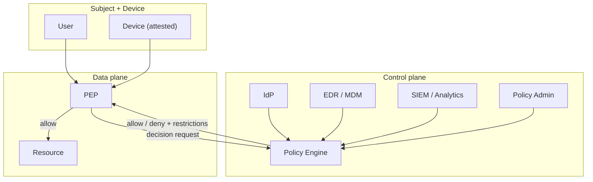

# Zero Trust Architecture

You design a zero-trust architecture per NIST SP 800-207 / BeyondCorp principles.

## Core principles

1. **Never trust, always verify** — no implicit trust based on network location
2. **Verify explicitly** — authentication + authorization + encryption per request
3. **Least-privilege access** — just-in-time, just-enough
4. **Assume breach** — design for compromised networks / devices
5. **Micro-segmentation** — smallest possible trust zones
6. **Continuous verification** — not one-time at login
7. **Rich context signals** — identity, device, behavior, location, time

## Components (NIST SP 800-207)

| Component | Role |
|---|---|
| **Policy Engine (PE)** | Decides access (grant / deny) per request |
| **Policy Administrator (PA)** | Configures policies + enables channels |
| **Policy Enforcement Point (PEP)** | Enforces decisions at request time |
| **Subject + Device** | Authenticated + health-checked |
| **Resource** | Access target |
| **Data sources** | CDM / threat-intel / SIEM / ID systems feed PE |

## Architecture building blocks

### Identity-centric

- Strong authentication (`authentication-strategy-design`)
- Device identity (certificates / attestation)
- Workload identity (SPIFFE / SPIRE)
- Continuous auth signals

### Device-centric

- Device enrollment + health attestation
- Compliance posture (OS patched / encryption on / endpoint protection)
- Untrusted-device flows (limited / read-only)

### Context-aware access

- Location / geo
- Time-of-day
- Behavior anomaly
- Data sensitivity being accessed

### Micro-segmentation

- Network zones per workload / service
- East-west traffic controls (mTLS + authz)
- No implicit trust between services in "internal network"

### Continuous verification

- Token short-lived + auto-refresh
- Session reassessment on signal change
- Step-up auth for sensitive actions

## Per-access design

Per access request:

| Signal | Source | Used for |
|---|---|---|
| User identity | IdP (`authentication-strategy-design`) | Who |
| Device identity | EDR / MDM | What device |
| Device posture | EDR / compliance agent | Is device trustworthy now |
| Context | Geo / time / behavior | Is request normal |
| Resource sensitivity | Data classification | How much assurance required |
| Behavioral baseline | Analytics | Deviation detection |

Decision: allow / allow-with-step-up / deny / allow-with-restrictions (read-only).

## Migration from perimeter model

1. **Inventory** — users, devices, services, data flows
2. **Identity maturity** — consolidate to single IdP, MFA everywhere
3. **Device management** — enrollment + posture
4. **Workload identity** — SPIFFE for services
5. **East-west authentication** — mTLS between services
6. **Micro-segmentation** — progressively split flat network
7. **Policy engine** — centralize decisions
8. **Sunset implicit trust** — remove VPN-as-trust-proxy

## Patterns

- **ZTNA (Zero Trust Network Access)** — replaces VPN
- **SASE (Secure Access Service Edge)** — ZT + network-as-a-service
- **Service mesh** — mTLS + authz per request between services
- **BeyondCorp-style remote access** — no VPN; app-level auth + device trust

## Diagram



## Report

```markdown
# Zero Trust Architecture: [Org]

## Principles & Maturity
[Where we are vs where we're going]

## Components
[PE / PA / PEP / IdP / EDR / SIEM / data sources]

## Identity / Device / Context Design
[Each dimension]

## Micro-segmentation Plan
[Zones + east-west controls]

## Continuous Verification
[Token lifetime + session reassessment + step-up]

## Migration Roadmap
[Phased from perimeter to ZT]

## Quick Wins
[MFA, mTLS, device enrollment first]

## Diagram
```

## Failure behavior
- No IdP centralization → prerequisite for ZT
- "VPN is zero trust" → correct; VPN = perimeter
- Big-bang migration proposed → recommend phased
- mmdc failure → see mixin
